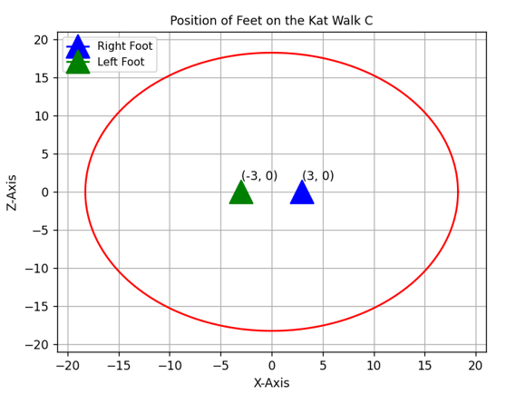
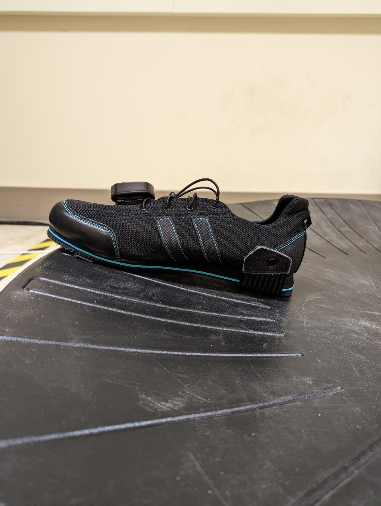

# vr-kat-project-python-research
# KAT Walk C: Foot Estimation Position Code

## Description

One of the issues of the KAT Walk C is the lack of positional awareness of the foot relative to the surface of the treadmill (is it forward, back, centre, left, right, etc.).

However the KAT Walk C has one interesting attribute, the incline that the foot experiences when the users foot moves away from the centre of the KAT Walk C surface. This then leads to an idea that this incline would result in each position on the KAT Walk C having a unique sensor reading, meaning that we can use this uniqueness in order to estimate the rough position of the foot. 

This project focuses on estimating the position of the KAT Walk C based on the current sensor reading and using that sensor reading in order to estimate the position based on key points gathered along the surface and using an interpolation formula. 

This program however had one strong assumption, since we rely on sensor readings to estimate the position of the foot, the foot must slide around the KAT Walk C surface in order to get acccurate estimates, which yield unnatural movements. Since natural walking or motion results in the act of lifting the foot off the ground, this results in unexpected sensor readings. 

<figure>
  
  <figcaption>Figure 1: This figure demonstrates a visual of the estimation of the foot along the surface of the KAT Walk C. The red outline represents the edge of the KAT Walk C (notice the radius is around 17 which represents 17 inches). The centre of the KAT Walk C is marked at point (0, 0). The left foot is marked represented by green triangle, and right foot represented by the blue triangle. </figcaption>
</figure>

<figure>
  
  <figcaption>Figure 2: This figure demonstrates the incline that the foot experiences as the foot moves further away from the centre of the KAT Walk C. </figcaption>
</figure>

This program is very very experimental and was created in the early-stages of the project. One of the troubles when dealing with this project was fetching sensor data from the KAT Walk C. Since at the time it was not possible, the method used in this project was opening the KAT Gateway software (which presented the sensor data). Used a package to screenshot the part of the screen which contained the KAT Gateway (aka. a screen scraper), and use that screenshot annd turn it into a string with all of the elements. 

The part that slowed this program a lot was the algorithm to package to turn screenshots into characters (pytesseract). This yielded at being able to fetch sensor data at around 5fps (which is not ideal especially in the video game standard). 

## Required Python Packages

This project will require Python version 3.6 or higher and all of the following packages:

- pip install pandas
- pip install numpy
- pip install matplotlib
- pip install pyautogui
- pip install pytesseract
- pip install opencv-python
- pip install keyboard

Additionally to installing the pytesseract package, an additionnal program may be necessary to get that package working, see the following link: https://pyimagesearch.com/2021/08/16/installing-tesseract-pytesseract-and-python-ocr-packages-on-your-system/

## Technical Details

- KATData: contains the logic to fetch the kat data from taking a screenshot of the screen and finding the exact position of where my sensor data values are and optical character recognition algorithm to turn it to numbers. 

- key_points_excel: contains all the keypoints used for different number of key points, these excel sheets contain the relationship between sensor value and foot position. 

- PositionUI: contains the code of the static image of what the UI should look like (Figure 1).

- RotationMaps: Contains the logic on how estimate the position based on the sensor value provided. 

- testPlotAnimation.py: test logic which contains a loop of fetching data, estimating a position based on data, creating a subplot annd plotting the new position. Again, this was able to do it at around 5fps. 

